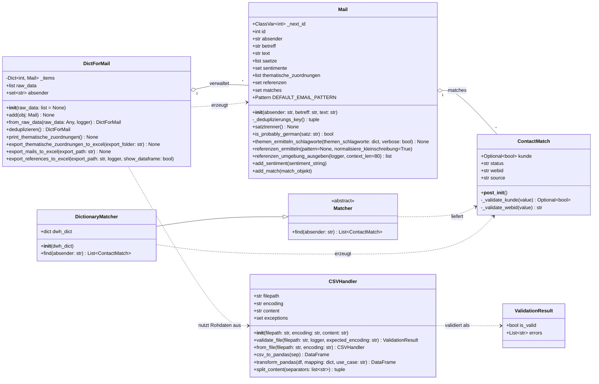
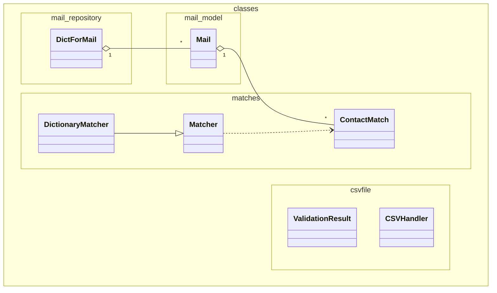
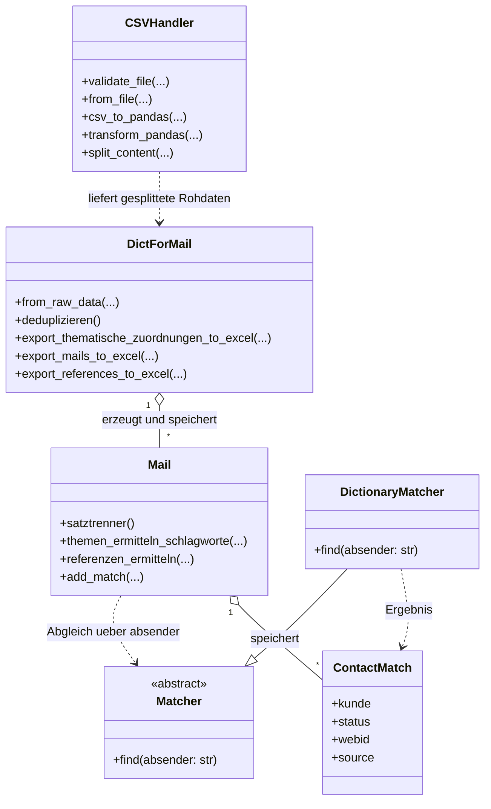

# UML-Klassendiagramme

Die Diagramme bilden die produktiven Klassen aus `classes/` ab. Ausgenommen sind Testcode, der Ordner `hilfsfunktionen/` sowie freie Hilfsfunktionen und Ablaufcode aus `main.py`.

Fuer Mermaid-Renderer, die kein Markdown parsen, liegen die Diagramme zusaetzlich einzeln ohne Code-Fences vor:
`docs/uml_overview.mmd`, `docs/uml_packages.mmd` und `docs/uml_flow.mmd`.

## Gesamtuebersicht

## Paketstruktur

## Fachlicher Ablauf

